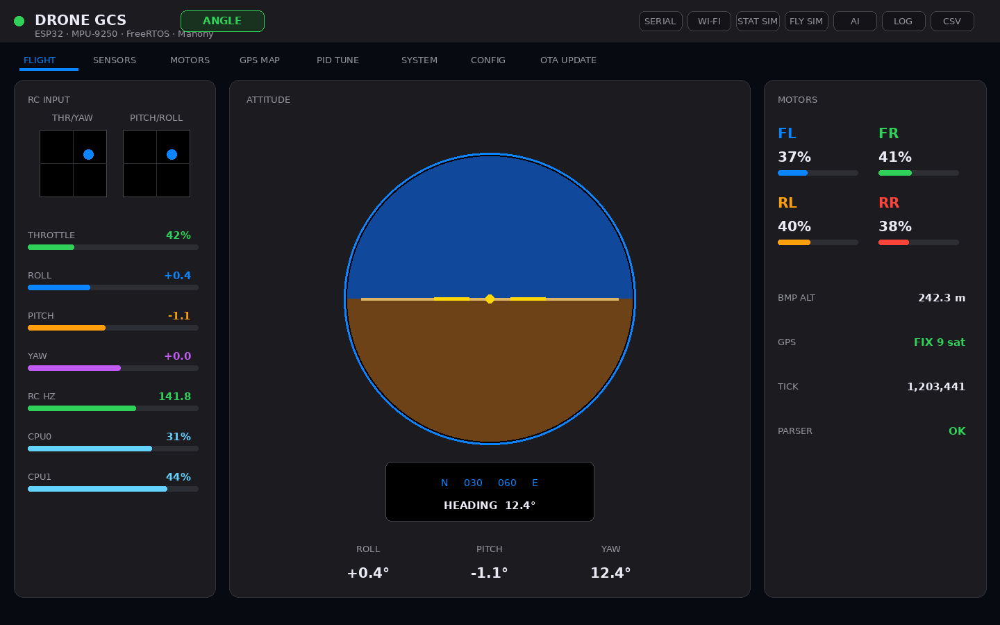
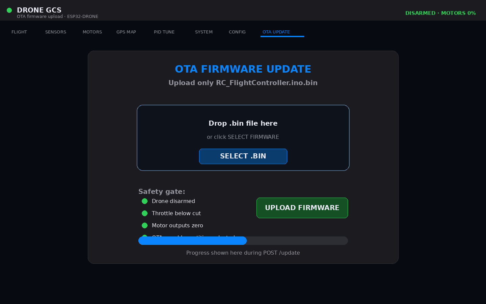
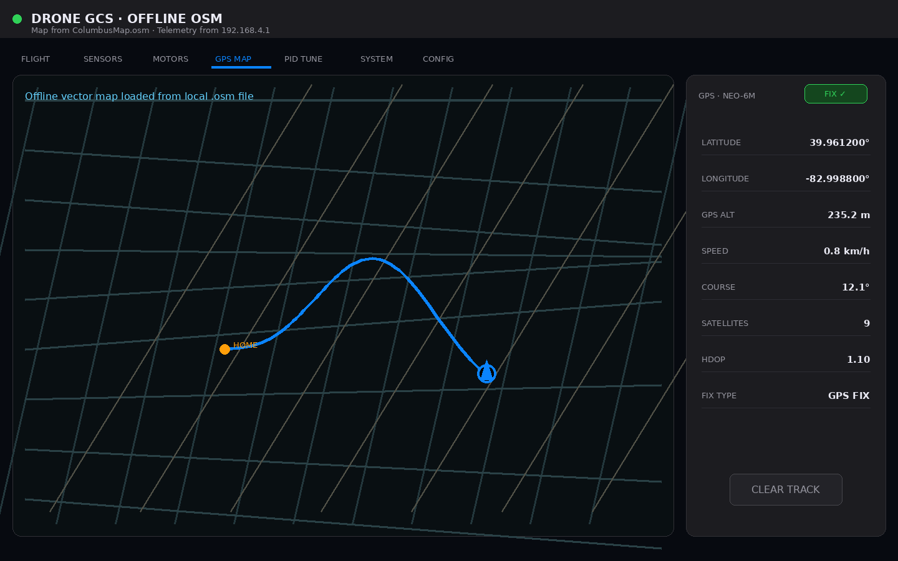

# ESP32 Quadcopter Flight Controller

A custom quadcopter flight controller built around the **Adafruit HUZZAH32 / ESP32-WROOM-32E**, written in Arduino C++ on top of FreeRTOS. The project targets both stable flight and rigorous embedded-systems research: real-time scheduling, sensor fusion, Wi-Fi telemetry, onboard logging, runtime PID tuning, autonomous calibration, and over-the-air firmware updates, all on a $10 microcontroller.

**Firmware version:** v4.0.0  
**Control loop:** 400 Hz, `esp_timer`-driven, pinned to Core 1  
**AHRS default:** Attitude EKF (switchable at runtime to Mahony or Madgwick)

---

## Open The Arduino Sketch

Open this file in Arduino IDE:

```text
RC_FlightController/RC_FlightController.ino
```

The folder name and the `.ino` file name match on purpose. Arduino expects that shape:

```text
RC_FlightController/
  RC_FlightController.ino
  src/
    Submodules/
      CalManager/
      IMU/
      Madgwick/
      MahonyAHRS/
      MotorControl/
      ...
```

Think of `RC_FlightController.ino` like the pilot, and `src/Submodules` like the toolbox beside the pilot. When Arduino builds the sketch, it automatically compiles the tools in `src/Submodules`, so you should not need to move the libraries by hand.

`Madgwick` and `MahonyAHRS` are also under `src/Submodules`, so Arduino compiles them automatically with the rest of the flight code. The shared AHRS types live in `src/Submodules/AHRS`.

After cloning with submodules, compile from the sketch folder:

```bash
git submodule update --init --recursive
arduino-cli compile --fqbn esp32:esp32:esp32 RC_FlightController
```

---

## Ground Station

| Dashboard | OTA upload | Offline OSM map |
|---|---|---|
|  |  |  |

---

## What This Project Does

Core loop:

```
Read IMU → notch-filter → AHRS/EKF → read RC → cascaded PID → motor mixer → ESC PWM
```

Surrounding infrastructure:

```
RC iBUS parsing           Autonomous sensor calibration
BMP280 barometer          GPS position + velocity
Wi-Fi AP + HTTP server    Browser-based ground station
Runtime PID / AHRS tuning Onboard high-speed CSV flight log
OTA firmware upload        Offline OSM map
Timing jitter measurement  Dynamic FFT notch tracking
CPU utilization monitor    ToF altitude sensor (optional)
```

Development philosophy:

```
1. Make the system safe.
2. Make the sensors trustworthy.
3. Make ACRO/rate mode stable.
4. Tune ANGLE/self-level mode.
5. Improve telemetry, logging, and test rigor.
```

---

## Capability Summary

| Area | Current capability |
|---|---|
| MCU | Adafruit HUZZAH32 Feather / ESP32-WROOM-32E |
| RTOS | Dual-core FreeRTOS, 7 tasks |
| IMU | MPU-9250 / MPU-6500 over SPI at 400 Hz |
| AHRS | Runtime-selectable: EKF (default), Mahony, Madgwick |
| Vibration filter | Static notch + dynamic FFT-tracked notch (45–170 Hz) |
| RC | FlySky FS-i6X + FS-iA6B iBUS, 200 Hz |
| Flight modes | ANGLE (self-level), ACRO (rate), DISARMED, FAILSAFE |
| Control | Cascaded angle+rate PID, yaw heading-hold |
| Motors | X-frame mixer, PWM ESCs via ESP32 LEDC |
| Barometer | BMP280 over I²C, 20 Hz, vertical speed estimate |
| GPS | u-blox NEO-6M / GY-GPS6MV2, NMEA UART, 50 Hz drain |
| Telemetry | ESP32 Wi-Fi AP + HTTP JSON endpoints |
| Ground station | Single-file HTML GCS, no build step |
| Runtime tuning | Full gain/filter payload via `/tune`, rejected while armed |
| Onboard logging | 100 Hz ring-buffer CSV log, 100 rows (1 s), streamed via HTTP |
| Timing log | Welford jitter stats + 800-sample ring buffer via `/timing` |
| OTA | Browser `.bin` upload via `/update`, safety-gated |
| Calibration | Autonomous gyro + 6-position accel + magnetometer + ESC via RC |
| Offline maps | Local `.osm` file loaded in browser, no internet required |
| CPU monitor | Per-core utilization estimate via idle hook |
| ToF | VL53L4CX optional altitude sensor (I²C shared with BMP280) |

---

## Hardware

| Subsystem | Part | Notes |
|---|---|---|
| Flight controller | Adafruit HUZZAH32 / ESP32-WROOM-32E | Main MCU, dual-core, Wi-Fi |
| IMU | MPU-9250 / MPU-6500 / GY-91 | Gyro + accel; onboard AK8963 mag if present |
| Barometer | BMP280 | Pressure, temperature, altitude |
| GPS | GY-GPS6MV2 / u-blox NEO-6M | Latitude, longitude, speed, satellites |
| RC transmitter | FlySky FS-i6X | 10-channel |
| RC receiver | FlySky FS-iA6B | iBUS serial protocol |
| ESCs | Standard PWM ESCs | 50 Hz PWM, 1000–2000 µs pulse |
| Motors | 2212-class, ~920 KV | Quadcopter propulsion |
| Battery | 3S LiPo (11.1 V nominal) | Main power |
| BEC | 5 V BEC | Powers controller and receiver |
| ToF (optional) | VL53L4CX | Altitude, shared I²C bus |

---

## Pin Map

| Function | GPIO | HUZZAH32 label | Direction | Notes |
|---|---:|---|---|---|
| SPI SCK | 5 | SCK | ESP32 → IMU | MPU-9250 clock |
| SPI MOSI | 18 | MO | ESP32 → IMU | MPU-9250 data in |
| SPI MISO | 19 | MI | IMU → ESP32 | MPU-9250 data out |
| MPU CS | 33 | 33 | ESP32 → IMU | Chip select |
| MPU INT | 27 | 27 | IMU → ESP32 | Wired but not driven by firmware |
| BMP280 SDA | 21 | SDA | Bidirectional | I²C data (shared with ToF) |
| BMP280 SCL | 22 | SCL | ESP32 → sensor | I²C clock (shared with ToF) |
| GPS RX | 13 | 13 | GPS TX → ESP32 | UART1 |
| GPS TX | 17 | 17 | ESP32 → GPS | UART1, optional |
| iBUS RX | 16 | 16 | Receiver → ESP32 | UART2 |
| iBUS TX | 4 | 4 | — | Spare, not connected |
| Motor FL | 25 | 25 | ESP32 → ESC | Front-left, CCW |
| Motor FR | 15 | 15 | ESP32 → ESC | Front-right, CW |
| Motor RL | 14 | 14 | ESP32 → ESC | Rear-left, CW |
| Motor RR | 32 | 32 | ESP32 → ESC | Rear-right, CCW |

Free GPIO: 23 (cleanest), 26 (ADC2/Wi-Fi caveat), 34/36/39 (input-only).

---

## Wiring Guide

### MPU-9250 / GY-91

| IMU pin | ESP32 pin | Notes |
|---|---|---|
| VCC | 3.3 V | Use 3.3 V only |
| GND | GND | Common ground |
| SCL / SCLK | GPIO 5 | SPI clock |
| SDA / MOSI | GPIO 18 | SPI MOSI |
| AD0 / MISO | GPIO 19 | SPI MISO |
| NCS / CS | GPIO 33 | Chip select — pull-up to 3.3 V if unused |
| INT | GPIO 27 | Wired to GPIO 27; firmware does not use it |

Expected `WHO_AM_I`:

```
0x71  MPU-9250
0x70  MPU-6500 / MPU-9250 gyro-accel die
```

If the AK8963 magnetometer is absent or unresponsive, roll and pitch remain accurate. Yaw will drift without magnetic heading correction.

---

### BMP280

| BMP280 pin | ESP32 pin | Notes |
|---|---|---|
| VCC | 3.3 V | |
| GND | GND | |
| SDA / SDI | GPIO 21 | I²C data |
| SCL / SCK | GPIO 22 | I²C clock |
| CSB | 3.3 V | Pull high to force I²C mode |
| SDO | GND or 3.3 V | GND → address `0x76`, 3.3 V → `0x77` |

The firmware scans both addresses automatically. If nothing is found, verify CSB is pulled high and SDO is tied to a rail.

---

### GPS (GY-GPS6MV2 / NEO-6M)

| GPS pin | ESP32 pin | Notes |
|---|---|---|
| VCC | 3.3 V or module VIN | Many NEO-6M boards have an onboard regulator |
| GND | GND | |
| TXD | GPIO 13 | GPS → ESP32 (UART1 RX) |
| RXD | GPIO 17 | ESP32 → GPS (optional) |

```
UART:     UART1
Baud:     9600
Protocol: NMEA 0183
Parsed:   GPRMC, GPGGA
```

Cold fix outdoors: 30–90 seconds. Indoor fix is unreliable. A blinking blue LED on the module typically indicates a live fix.

---

### FlySky FS-iA6B iBUS

| Receiver pin | ESP32 pin | Notes |
|---|---|---|
| iBUS port | GPIO 16 | UART2 RX — use the dedicated iBUS/S.BUS port |
| VCC | 5 V from BEC | Receiver accepts 4.0–6.5 V |
| GND | GND | |

```
UART:         UART2
Baud:         115200
Frame length: 32 bytes
Frame period: ~7 ms
Rate:         ~142 Hz from receiver, polled at 200 Hz by firmware
```

Use the **iBUS port** on the receiver, not the individual CH1–CH6 servo outputs.

---

### ESC and Motor

| Motor | GPIO | Position | Spin | Notes |
|---|---:|---|---|---|
| FL | 25 | Front-left | CCW | 33 Ω series resistor recommended |
| FR | 15 | Front-right | CW | 33 Ω series resistor recommended |
| RL | 14 | Rear-left | CW | 33 Ω series resistor recommended |
| RR | 32 | Rear-right | CCW | 33 Ω series resistor recommended |

ESC ground and ESP32 ground must share a common reference. Without this, motor signals behave unpredictably.

---

## Motor Layout and Mixer

X-frame, viewed from above:

```
            Front

    FL  CCW          FR  CW
    GPIO 25          GPIO 15

         \           /
          \         /
           \       /
            ---X---
           /       \
          /         \
         /           \

    RL  CW           RR  CCW
    GPIO 14          GPIO 32

            Rear
```

Mixer equations:

```
FL = throttle + rollOut - pitchOut - yawOut
FR = throttle - rollOut - pitchOut + yawOut
RL = throttle + rollOut + pitchOut + yawOut
RR = throttle - rollOut + pitchOut - yawOut
```

Before first flight, verify signs by hand with props removed:

- Tilt right → correction must push right side up.
- Tilt left → correction must push left side up.
- Tilt nose down → correction must push nose up.
- Tilt nose up → correction must push nose down.
- Any reversal means a motor order, IMU axis sign, or mixer sign error. Fix it in code, not with PID tuning.

---

## RC Channel Mapping

| Channel | Transmitter control | Firmware function |
|---|---|---|
| CH1 | Right stick L/R | Roll |
| CH2 | Right stick U/D | Pitch |
| CH3 | Left stick U/D | Throttle |
| CH4 | Left stick L/R | Yaw |
| CH5 | VrA knob | Spare |
| CH6 | VrB knob | ESC calibration trigger (full-right = request) |
| CH7 | SWA | Arm / disarm |
| CH8 | SWB | ANGLE / ACRO mode |
| CH9 | SWC | Accelerometer calibration confirmation |
| CH10 | SWD | Calibration trigger (rising edge, disarmed only) |

---

## Flight Modes

### DISARMED

Motors are off. Permitted actions:

- Sensor calibration
- Runtime tuning via `/tune`
- OTA upload via `/update`
- Bench sensor checks
- Level-zero capture (SWB high while disarmed)

### ANGLE mode

Self-leveling. The stick commands a target lean angle. When the stick centres, the target returns to zero and the quad levels itself.

```
RC stick → target angle → angle PID → target rate → rate PID → motor mixer
```

Tune ACRO mode first. Then add ANGLE mode.

### ACRO mode

Rate mode. The stick commands angular velocity. Releasing the stick stops rotation but does not self-level.

```
RC stick → target rate → rate PID → motor mixer
```

### Yaw heading hold

When the yaw stick is within `yaw_deadband` of centre, the firmware holds the last commanded heading using a yaw angle PID. Moving the stick beyond the deadband switches to rate mode for yaw.

### FAILSAFE

If iBUS frames stop arriving, the receiver driver marks the signal invalid and motor outputs are cut immediately.

---

## FreeRTOS Task Architecture

| Task | Core | Priority | Stack (words) | Rate | Purpose |
|---|---:|---:|---:|---:|---|
| `taskControl` | 1 | 5 | 10240 | 400 Hz (esp_timer) | IMU, AHRS, PID, motor output |
| `taskRC` | 0 | 3 | 6144 | 200 Hz | iBUS parsing, arm/cal triggers |
| `taskGPS` | 0 | 1 | 4096 | 50 Hz | GPS NMEA drain and parse |
| `taskSerial` | 0 | 1 | 4096 | 20 Hz | Serial status and PID trace |
| `taskBMP` | 0 | 1 | 3072 | 20 Hz | BMP280 read, vertical speed |
| `taskCPU` | 0 | 1 | 3072 | 2 Hz | CPU utilization estimate |
| `taskWiFi` | 0 | 1 | 12288 | Event-driven | HTTP server, telemetry, OTA |

Core 1 is entirely dedicated to the control loop. All communication and slower sensors run on Core 0.

The control loop is released by an `esp_timer` ISR calling `xTaskNotifyGive()` every 2500 µs. `vTaskDelay()` is not used in `taskControl` because the FreeRTOS tick resolution on this build can be coarser than 2.5 ms.

---

## AHRS / Attitude Estimation

The firmware supports three attitude estimators, switchable at runtime via `/tune` without rebooting:

| Mode | `ahrs_filter_mode` | Description |
|---|---:|---|
| EKF (default) | 0 | 6-DOF or 9-DOF extended Kalman filter with gyro bias estimation |
| Mahony | 1 | Complementary filter, fast, low CPU cost |
| Madgwick | 2 | Gradient-descent complementary filter |

Switching estimator resets both EKF and Madgwick state to avoid attitude transients from stale quaternions.

**Pipeline order:** raw IMU → static notch filter → dynamic notch filter → AHRS → PID.

---

## Signal Filtering

### Static notch filter

A biquad notch filter is applied to all 6 IMU axes (3 accel + 3 gyro) before the AHRS. Default centre frequency: 90 Hz, Q: 8. Both are tunable at runtime.

### Dynamic FFT notch tracking

The `SpectrumAnalyzer` collects IMU data and runs an FFT. Every 250 ms (10 Hz), `updateDynamicNotchFromFFT()` finds the dominant gyro peak in the 45–170 Hz range and updates the notch centre frequency toward it using an exponential smoothing step capped at 2 Hz per update. The notch will not track while disarmed or below 15% throttle.

---

## Runtime Tuning

POST to `/tune` with a JSON body while **disarmed**. Any key can be omitted. The request is rejected while armed.

### Pilot limits

| Key | Default | Meaning |
|---|---:|---|
| `max_angle_deg` | 25.0 | Maximum lean in ANGLE mode (degrees) |
| `max_rate_dps` | 150.0 | Maximum roll rate in ACRO (deg/s) |
| `max_pitch_rate_dps` | 150.0 | Maximum pitch rate in ACRO (deg/s) |
| `yaw_max_rate_dps` | 90.0 | Maximum yaw rate (deg/s) |
| `yaw_deadband` | 0.05 | Stick fraction below which heading hold activates |

### PID authority limits

| Key | Default | Meaning |
|---|---:|---|
| `roll_output_limit` | 0.500 | Max roll correction before mixing |
| `pitch_output_limit` | 0.500 | Max pitch correction before mixing |
| `yaw_output_limit` | 0.200 | Max yaw correction before mixing |

### Throttle shaping

| Key | Default | Meaning |
|---|---:|---|
| `throttle_expo` | 0.60 | Softens low-throttle response |
| `throttle_up_rate_per_sec` | 0.70 | Max throttle increase rate per second |
| `throttle_down_rate_per_sec` | 1.00 | Max throttle decrease rate per second |
| `motor_idle` | 0.08 | Minimum motor output when armed and throttle above cut |
| `motor_max` | 0.80 | Maximum motor output cap |
| `throttle_cut` | 0.03 | Below this throttle, motors are cut |
| `idle_ramp_end` | 0.15 | Throttle fraction where idle blending ends |

### Rate PID (inner loop)

| Key | Default |
|---|---:|
| `pid_roll_kp` | 0.00015 |
| `pid_roll_ki` | 0.00000 |
| `pid_roll_kd` | 0.00001 |
| `pid_pitch_kp` | 0.00015 |
| `pid_pitch_ki` | 0.00000 |
| `pid_pitch_kd` | 0.00001 |
| `pid_yaw_kp` | 0.00015 |
| `pid_yaw_ki` | 0.00000 |
| `pid_yaw_kd` | 0.00001 |
| `pid_ilimit` | 50.0 |

### Angle PID (outer loop)

| Key | Default |
|---|---:|
| `pid_angle_roll_kp` | 8.00 |
| `pid_angle_roll_ki` | 0.00 |
| `pid_angle_roll_kd` | 0.010 |
| `pid_angle_pitch_kp` | 8.00 |
| `pid_angle_pitch_ki` | 0.00 |
| `pid_angle_pitch_kd` | 0.010 |
| `pid_angle_yaw_kp` | 6.00 |

### Notch filter

| Key | Default | Meaning |
|---|---:|---|
| `notch_enable` | true | Enable static notch |
| `notch_freq_hz` | 90.0 | Centre frequency (Hz) |
| `notch_q` | 8.0 | Q factor — higher = narrower |

### AHRS

| Key | Default | Meaning |
|---|---:|---|
| `ahrs_filter_mode` | 0.0 | 0 = EKF, 1 = Mahony, 2 = Madgwick |
| `mahony_kp` | (from object) | Mahony proportional gain |
| `mahony_ki` | (from object) | Mahony integral gain |
| `madgwick_beta` | 0.080 | Madgwick beta |

### Attitude EKF

| Key | Default | Meaning |
|---|---:|---|
| `ekf_angle_q` | 0.0008 | Process noise — angle states |
| `ekf_bias_q` | 0.000001 | Process noise — gyro bias states |
| `ekf_accel_r` | 0.060 | Accel measurement noise (higher = trust less) |
| `ekf_mag_r` | 0.200 | Magnetometer measurement noise |
| `ekf_mag_declination_deg` | 0.0 | Local magnetic declination |
| `ekf_mag_yaw_offset_deg` | 0.0 | Yaw alignment offset |
| `ekf_mag_yaw_sign` | 1.0 | +1 or -1 to correct mag axis sign |

---

## Serial Commands

| Command | Effect |
|---|---|
| `p` | Toggle ~4 Hz `[PID]` tuning trace on/off (off at boot) |

---

## HTTP Endpoints

The ESP32 creates a Wi-Fi access point:

```
SSID:     ESP32-DRONE
Password: 12345678
IP:       192.168.4.1
```

| Endpoint | Method | Purpose |
|---|---|---|
| `/telemetry` | GET | Full flight state JSON |
| `/tune` | POST | Apply PID / AHRS / filter gains (disarmed only) |
| `/log?since=N` | GET | Calibration and system log lines since index N |
| `/timing` | GET | Jitter stats JSON (Welford mean, std, max, violations) |
| `/timing/reset` | POST | Reset jitter accumulator |
| `/timing/csv` | GET | Raw 800-sample period ring buffer as CSV |
| `/flightlog/csv` | GET | Freeze and download 100-row onboard flight log CSV |
| `/flightlog/reset` | POST | Clear onboard log and resume writing |
| `/update` | GET | OTA upload page |
| `/update` | POST | OTA firmware upload (disarmed, throttle low, motors off) |

---

## Onboard Flight Log

The firmware maintains a 100-row ring buffer sampled at 100 Hz (every 4th control cycle). Each row is approximately 320 bytes and captures:

```
Timestamps and loop count       RC stick inputs (all 10 channels)
IMU timing phases               Throttle (raw, shaped, smoothed)
Period and jitter               AHRS attitude (roll, pitch, yaw)
Raw and filtered IMU data       Control attitude (after level-zero offset)
Magnetometer                    PID targets, errors, and outputs
EKF gyro bias estimates         Motor commands and estimated RPM
Notch filter state              BMP280 altitude and vertical speed
AHRS mode and mag-accept flag   CPU utilization (Core 0 and Core 1)
```

Workflow:

```
POST /flightlog/reset  → clears buffer and re-enables writing
ARM + fly
DISARM
GET  /flightlog/csv    → freezes buffer and streams CSV
```

To extend the log beyond 1 second, increase `FLIGHT_LOG_SIZE` (currently 100). At 320 bytes per row and ~300 KB free heap in a typical flight build, 300 rows (~3 seconds) is a safe upper bound.

---

## Autonomous Calibration

Calibration runs inside `taskControl` on Core 1 and is triggered by RC or HTTP. While calibration is active, the flight loop is blocked and motor outputs are inhibited.

### IMU calibration (guided, via SWD + SWC)

1. **Disarm** the craft (SWA low).
2. Flip **SWD** up to request calibration.
3. **Gyro phase** (automatic): place the drone flat and still. The firmware waits 3 seconds for settling, then samples 5 seconds of gyro data.
4. **Accel phase** (6 positions): flip **SWC** up to confirm each orientation. The firmware prompts each pose over the serial log.
5. **Magnetometer phase** (if present): rotate the drone slowly in all axes for 30 seconds.
6. Calibration saves to NVS (non-volatile storage) and loads automatically on every subsequent boot.

### ESC calibration (via VrB + SWC)

1. **Disarm** and set throttle to minimum.
2. Raise **VrB** (CH6) to full right.
3. Confirm with **SWC** when prompted.
4. Lower VrB to cancel at any time.

Calibration is rejected if the craft is armed or throttle is above `throttle_cut`.

---

## Software Level-Zero Trim

While **disarmed** with **SWB** held high (ACRO position), the firmware averages 1.2 seconds of AHRS attitude output and saves it as a roll/pitch/yaw offset. All subsequent control attitude values are computed relative to this zero. This corrects for frame twist or a non-level mounting surface without touching IMU calibration or the AHRS quaternion.

---

## Wi-Fi Ground Station

The browser-based GCS (`DroneGroundStation.html`) connects directly to `http://192.168.4.1`. No build step or internet connection is required once the file is open.

Features:

- Live attitude display (roll, pitch, yaw)
- Motor output gauges
- PID output traces
- Barometer altitude and vertical speed
- GPS position and satellite count
- Timing jitter chart
- Full PID, AHRS, and filter tuning panel
- Calibration log stream
- OTA firmware upload panel

---

## Offline OSM Map

When connected to `ESP32-DRONE`, the laptop has no internet. Tile-based maps will not load. The offline OSM workflow serves a local map extract from the laptop instead.

Recommended folder layout:

```
DroneGCS/
├── DroneGroundStation.html
└── YourArea.osm
```

Run a local server:

```bash
cd path/to/DroneGCS
python3 -m http.server 8080
```

Open in the browser:

```
http://localhost:8080/DroneGroundStation.html
```

The GCS fetches telemetry from `http://192.168.4.1` while the OSM file is loaded locally. Use only a small OSM extract around your test field — large files slow the browser significantly.

Good sources for OSM extracts:

- OpenStreetMap.org export (small bounding box)
- BBBike extract service
- Geofabrik extract, cropped with Osmium or QGIS

The map is for situational awareness only — it is not autonomous navigation.

---

## OTA Firmware Update

### Arduino IDE partition scheme

Select before the first USB flash:

```
Tools → Partition Scheme → Minimal SPIFFS (1.9MB APP with OTA and 190KB SPIFFS)
```

This provides two app slots for OTA while giving the application maximum flash space. The GCS is served from the laptop, so a large SPIFFS partition is not needed.

Do **not** use `No OTA` or `Huge APP without OTA`.

### Exporting the binary

1. Select the correct board and partition scheme.
2. Flash once by USB.
3. Click **Sketch → Export Compiled Binary**.
4. Click **Sketch → Show Sketch Folder** and find the build output.
5. Upload the correct file through OTA:

```
RC_FlightController.ino.bin          ← upload this
```

Do not upload:

```
boot_app0.bin
RC_FlightController.ino.bootloader.bin
RC_FlightController.ino.partitions.bin
RC_FlightController.ino.merged.bin
RC_FlightController.ino.elf
```

### OTA safety gate

The firmware permits OTA only when all three conditions hold:

```
armed == false
throttle <= throttle_cut
all motor outputs <= 0.001
```

Remove propellers before every OTA session.

---

## First-Time Setup

### Step 1 — Bench safety

```
REMOVE PROPELLERS
```

### Step 2 — Flash firmware

```
Board:          Adafruit ESP32 Feather
Upload speed:   921600
Partition:      Minimal SPIFFS (1.9MB APP with OTA)
```

### Step 3 — Read the boot log

Open Serial Monitor at **115200 baud**. Expected output:

```
[BOOT] IMU... OK
[BOOT] AK8963 magnetometer: DETECTED  (or NOT FOUND)
[BOOT] BMP280... OK  (or not found)
[BOOT] GPS (GY-GPS6MV2)...
[BOOT] NVS calibration... loaded  (or none)
[BOOT] iBUS ready.
[BOOT] All tasks running.
[BOOT] Ground station: http://192.168.4.1
[BOOT] Free heap: XXXXXX bytes
```

If the IMU fails, halt is immediate — check SPI wiring and 3.3 V power.

### Step 4 — Check RC

Turn on the transmitter and confirm:

```
[iBUS] ~142 Hz good | 0 bad/s | 0 bad total   (should appear every second)
```

Confirm sticks, SWA arm/disarm, SWB mode change, SWD calibration trigger.

### Step 5 — Calibrate sensors

With props removed:

1. Keep SWA disarmed.
2. Flip SWD up (rising edge triggers calibration).
3. Follow prompts in the serial log.
4. Calibration saves to NVS and reloads on every boot.

### Step 6 — Verify motor order and mixer

With props still removed:

- Arm the craft.
- Raise throttle slightly.
- Confirm FL/FR/RL/RR match physical position.
- Tilt the frame by hand and confirm PID corrections oppose the tilt.
- Disarm before anything else.

### Step 7 — First powered hover

```
Small props
max_angle_deg = 10
motor_max = 0.60
angle I gains = 0
Conservative throttle
Short hover bursts
```

Do not attempt to hover until Step 6 is confirmed.

---

## Tuning Order

1. Props off: verify sensor sign and motor correction direction (Step 6).
2. ACRO mode first: tune `pid_roll_kp`, `pid_pitch_kp` for stable rate response with no oscillation.
3. Add `kd` carefully — unfiltered derivative amplifies gyro noise at 400 Hz.
4. ANGLE mode second: tune `pid_angle_roll_kp`, `pid_angle_pitch_kp`.
5. Keep angle I gains at zero until P and D are settled.
6. Tune yaw separately — yaw authority is intentionally limited to `yaw_output_limit = 0.2`.
7. Use `/flightlog/csv` and the timing monitor to verify loop timing stays within budget during tuning.

---

## Timing Diagnostics

`GET /timing` returns a JSON object with:

```json
{
  "count": 12000,
  "target_us": 2500,
  "period_mean_us": 2501.3,
  "period_std_us": 18.4,
  "jitter_max_us": 142,
  "jitter_mean_us": 12.1,
  "jitter_violations": 3,
  "violation_thresh_us": 100,
  "p50_us": 2500,
  "p95_us": 2528,
  "p99_us": 2571
}
```

`GET /timing/csv` streams the last 800 raw period samples for offline analysis.

`POST /timing/reset` clears all accumulators for a clean measurement window.

The `[TIME]` serial line prints once per second:

```
[TIME] period=2501us jitter=+1us ctrl=XXXus full=XXXus headroom=+XXXus ...
```

A negative `headroom` value means a control overrun — the current cycle took longer than the 2500 µs budget.

---

## Troubleshooting

### Serial garbage

Baud rate must be **115200**. Confirm in the IDE Serial Monitor and any terminal emulator.

### IMU not found

```
3.3 V power to MPU
SPI wiring: SCK=5, MOSI=18, MISO=19, CS=33
No other SPI device sharing the bus without its own CS
```

### BMP280 not found

```
SDA=21, SCL=22
CSB pulled high to 3.3 V
SDO set for expected I²C address (0x76 or 0x77)
3.3 V power
```

### GPS no fix

```
Move outdoors with clear sky
Wait 30–90 seconds for cold fix
GPS TXD → GPIO 13
Antenna facing up
```

### No RC input / failsafe

```
iBUS port on receiver, not servo pins
GPIO 16 connected to iBUS signal wire
Receiver powered from 5 V BEC
Transmitter bound and powered
```

### Drone tips on throttle

Diagnose in this order:

1. Motor order (FL/FR/RL/RR positions).
2. Prop direction (CW/CCW per motor position).
3. ESC signal wiring.
4. IMU axis signs.
5. Mixer signs.
6. Centre of gravity.
7. Frame twist.
8. PID gains (only after all above are confirmed correct).

**Never use PID tuning to compensate for a motor order or sign error.**

### GPS map blank

When connected to `ESP32-DRONE`, the laptop has no internet. Use the offline OSM workflow, or connect both devices to a shared hotspot.

### OTA rejected

OTA is gated on disarmed + throttle low + motors off. Confirm all three in the GCS or serial log before uploading.

---

## Known Firmware Issues (v4.0.0)

The following issues are identified and tracked for the next release:

| # | Issue | Impact |
|---|---|---|
| 1 | `[MOTOR_SAT]` Serial.printf fires unconditionally at 400 Hz | Guaranteed control overrun while armed |
| 2 | Motor writes throttled to 200 Hz (`MOTOR_UPDATE_PERIOD_US = 5000`) | Up to 5 ms stale motor command per cycle |
| 3 | `[DYN_NOTCH_HOOK]` and `[DYN_FFT_INPUT]` debug prints inside the 400 Hz IMU block | ~7 ms Serial cost on the cycle they fire |
| 4 | `thrSmooth` static local not reset on disarm | Inherited throttle state after disarm/re-arm |
| 5 | AHRS mode falls back to EKF (mode 0) on mutex miss | One-cycle estimator switch during flight |
| 6 | `calLog()` called from Core 1 inside `applyTuningToObjects()` | Priority inversion risk against Wi-Fi task |
| 7 | Unfiltered derivative term in PID | Gyro noise amplification at high Kd |
| 8 | Single `pid_ilimit = 50` shared across rate (dps) and angle (deg) loops | Dimensionally inconsistent wind-up limit |
| 9 | `FLIGHT_LOG_SIZE = 100` but comment says 300 | Log is 1 s, not 3 s |
| 10 | `BATTERY_VOLTAGE = 11.1` hardcoded | RPM estimates degrade with battery sag |

---

## Safety Rules

- **Remove propellers** before USB flashing, OTA, calibration, or bench tests.
- Never arm on USB power alone.
- Never attempt OTA while armed.
- Never tune while armed (the firmware enforces this for `/tune`).
- Keep first hover tests short and low.
- Use smaller props during early PID tuning.
- Keep a USB recovery path available at all times.
- GPS and map display are telemetry only — not navigation authority.

---

## Project Direction

This project supports both flight testing and embedded-systems research:

- ESP32 dual-core task partitioning and priority assignment
- `esp_timer` vs `vTaskDelay` for hard real-time control loops
- Wi-Fi interference with control-loop timing (characterised via `/timing`)
- Runtime filter tuning and AHRS mode switching without reboot
- OTA update safety gating
- Autonomous calibration usability over RC
- Offline field-map workflow
- Low-cost AHRS comparison (EKF vs Mahony vs Madgwick)
- Onboard high-speed logging for post-flight analysis
- LSTM-based fault prognosis using logged CSV data (companion research project)

The goal is a flying quadcopter that is also a rigorous test platform for every subsystem interaction.
