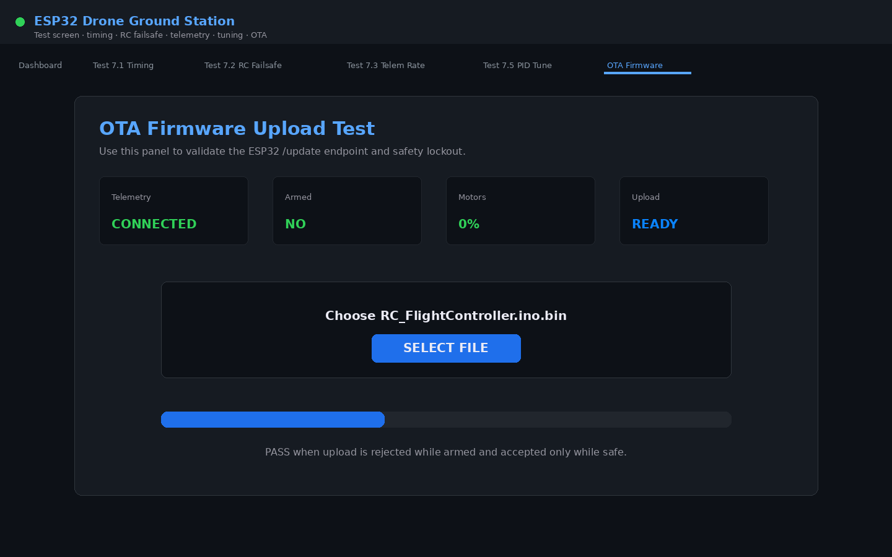

# ESP32 Quadcopter Flight Controller

This repository contains a custom quadcopter flight controller built around the **Adafruit HUZZAH32 Feather / ESP32-WROOM-32E**.

The project is more than a flying drone. It is also a practical systems-engineering test platform for learning how mechanical setup, sensor wiring, embedded software, real-time scheduling, control theory, Wi-Fi telemetry, GPS display, calibration, runtime tuning, offline maps, OTA firmware updates, and field workflow all interact on a low-cost microcontroller.

---

## Ground Station Snapshots

### Main GCS Flight Dashboard


### GCS OTA Upload Page


### Offline OSM GPS Map


### Test Screen OTA Panel



---

## What This Project Does

At the core, the flight controller does this:

```text
Read sensors → estimate attitude → read pilot command → run PID → mix motors
```

Around that, it also provides:

```text
RC input
sensor calibration
barometer data
GPS data
Wi-Fi telemetry
runtime tuning
onboard logging
offline GPS map
OTA firmware upload
timing/jitter testing
```

The intended development approach is:

```text
First make the system safe.
Then make the sensors trustworthy.
Then make ACRO/rate mode stable.
Then tune ANGLE/self-level mode.
Then improve telemetry, logging, OTA, and test rigor.
```

---

## Current Capability Summary

| Area | Current capability |
|---|---|
| MCU | Adafruit HUZZAH32 Feather / ESP32-WROOM-32E |
| RTOS | Dual-core FreeRTOS task architecture |
| IMU | MPU-9250 / MPU-6500 class IMU over SPI |
| AHRS | Mahony quaternion filter with live Kp/Ki tuning |
| RC | FlySky FS-i6X + FS-iA6B iBUS receiver |
| Control | ANGLE mode and ACRO mode |
| Motors | X-frame quad mixer with PWM ESC outputs |
| Barometer | BMP280 over I²C |
| GPS | u-blox NEO-6M / GY-GPS6MV2 over UART |
| Telemetry | ESP32 Wi-Fi AP + HTTP JSON endpoints |
| GCS | Browser-based ground station |
| Runtime tuning | Full tuning payload through `/tune`, rejected while armed |
| Offline maps | Local `.osm` file displayed by the GCS without internet |
| OTA | Browser `.bin` upload through `/update`, safety-gated |
| Logging | Browser CSV logging and onboard high-speed log download |

---

## Hardware Used

| Subsystem | Part | Purpose |
|---|---|---|
| Flight controller | Adafruit HUZZAH32 Feather / ESP32-WROOM-32E | Main MCU, Wi-Fi, FreeRTOS |
| IMU | MPU-9250 / MPU-6500 / GY-91 class board | Gyro and accelerometer; magnetometer if available |
| Barometer | BMP280 | Pressure, temperature, altitude estimate |
| GPS | GY-GPS6MV2 / u-blox NEO-6M | GPS fix, latitude, longitude, speed, satellites |
| RC transmitter | FlySky FS-i6X | Pilot input |
| RC receiver | FlySky FS-iA6B | iBUS serial receiver |
| ESCs | Standard PWM ESCs | Motor drive |
| Motors | 2212 class motors | Quadcopter propulsion |
| Battery | 3S or 4S LiPo | Main power |
| BEC | 5 V BEC | Powers controller and receiver |

---

## Full ESP32 Pin Map

This is the pin map used by the current firmware.

| Function | ESP32 GPIO | HUZZAH32 Label | Direction | Notes |
|---|---:|---|---|---|
| SPI SCK | GPIO 5 | SCK | ESP32 → IMU | MPU clock |
| SPI MOSI | GPIO 18 | MO | ESP32 → IMU | MPU data in |
| SPI MISO | GPIO 19 | MI | IMU → ESP32 | MPU data out |
| MPU CS / NCS | GPIO 33 | 33 | ESP32 → IMU | IMU chip select |
| MPU INT | GPIO 27 | 27 | IMU → ESP32 | Optional; currently not required |
| BMP SDA | GPIO 21 | SDA | Bidirectional | I²C data |
| BMP SCL | GPIO 22 | SCL | ESP32 → BMP | I²C clock |
| GPS RX | GPIO 13 | 13 | GPS TX → ESP32 | UART1 RX |
| GPS TX | GPIO 17 | 17 | ESP32 → GPS RX | Optional |
| iBUS RX | GPIO 16 | 16 | Receiver → ESP32 | UART2 RX |
| iBUS TX | GPIO 4 | 4 | ESP32 TX unused | Spare / not connected |
| Motor FL | GPIO 25 | 25 | ESP32 → ESC | Front-left motor |
| Motor FR | GPIO 15 | 15 | ESP32 → ESC | Front-right motor |
| Motor RL | GPIO 14 | 14 | ESP32 → ESC | Rear-left motor |
| Motor RR | GPIO 32 | 32 | ESP32 → ESC | Rear-right motor |

Important design choices:

- The **MPU uses SPI** because it needs high-speed deterministic sampling.
- The **BMP280 uses I²C** because pressure data is slow and does not need SPI speed.
- The **GPS uses UART1**.
- The **RC receiver uses UART2**.
- Motors use the **ESP32 LEDC PWM peripheral**.

---

## Wiring Guide

### MPU-9250 / GY-91 IMU Wiring

| IMU Pin | ESP32 / HUZZAH32 Pin | Notes |
|---|---|---|
| VCC | 3.3 V | Use 3.3 V unless your breakout explicitly supports VIN |
| GND | GND | Common ground |
| SCL / SCLK | GPIO 5 / SCK | SPI clock |
| SDA / MOSI | GPIO 18 / MO | SPI MOSI |
| AD0 / MISO | GPIO 19 / MI | SPI MISO |
| NCS / CS | GPIO 33 | Chip select |
| INT | GPIO 27 | Optional |

Expected WHO_AM_I values:

```text
0x71 → MPU-9250
0x70 → MPU-6500 / MPU-9250 gyro-accel die
```

If the magnetometer is not available, roll and pitch still work. Yaw will drift more because there is no magnetic heading correction.

---

### BMP280 Wiring

| BMP280 Pin | ESP32 Pin | Notes |
|---|---:|---|
| VCC | 3.3 V | Do not use 5 V unless the board has regulation/level shifting |
| GND | GND | Common ground |
| SDA / SDI | GPIO 21 | I²C data |
| SCL / SCK | GPIO 22 | I²C clock |
| CSB | 3.3 V | Pull high to force I²C mode |
| SDO | GND or 3.3 V | GND = `0x76`, 3.3 V = `0x77` |

The firmware attempts to detect the BMP280 at both common addresses.

If the serial log says no BMP was found, check:

```text
VCC = 3.3 V
GND common
SDA = GPIO 21
SCL = GPIO 22
CSB pulled high
SDO set for expected address
```

---

### GPS Wiring

| GPS Pin | ESP32 Pin | Notes |
|---|---:|---|
| VCC | 3.3 V or module VIN | Many NEO-6M boards accept 3.3–5 V through onboard regulator |
| GND | GND | Common ground |
| TXD | GPIO 13 | GPS transmits NMEA to ESP32 |
| RXD | GPIO 17 | Optional; not required for read-only operation |

GPS settings:

```text
UART: UART1
Baud: 9600
Protocol: NMEA 0183
Parsed sentences: GPRMC and GPGGA
```

Expected GPS behavior:

```text
Cold fix outdoors: 30–90 seconds
Indoor fix: often poor or no fix
Blue LED blinking: usually means GPS fix
```

---

### FlySky FS-iA6B iBUS Receiver Wiring

| Receiver Pin | ESP32 Pin | Notes |
|---|---:|---|
| iBUS output | GPIO 16 | UART2 RX |
| VCC | 5 V from BEC | Receiver accepts approximately 4.0–6.5 V |
| GND | GND | Common ground |

Use the small **S.BUS/iBUS port** on the FS-iA6B receiver. Do not use the individual CH1–CH6 servo outputs for this firmware.

iBUS settings:

```text
UART: UART2
Baud: 115200
Frame length: 32 bytes
Typical frame period: about 7 ms
Typical receiver rate: about 142 Hz
```

---

### ESC / Motor Wiring

| Motor | GPIO | Position | Rotation | Signal Notes |
|---|---:|---|---|---|
| FL | GPIO 25 | Front-left | CCW | 33 Ω series resistor recommended |
| FR | GPIO 15 | Front-right | CW | 33 Ω series resistor recommended |
| RL | GPIO 14 | Rear-left | CW | 33 Ω series resistor recommended |
| RR | GPIO 32 | Rear-right | CCW | 33 Ω series resistor recommended |

ESC signal wiring:

```text
ESC signal wire → ESP32 motor GPIO
ESC ground      → common ground
ESC power       → PDB / battery system
BEC 5 V         → controller 5 V input / receiver power
```

The ESC ground and ESP32 ground must be connected together. Without common ground, motor signals can behave unpredictably.

---

## Motor Layout and Mixer

The firmware assumes an **X-frame** quadcopter.

```text
          Front

      FL CCW       FR CW
       GPIO25     GPIO15

          \       /
           \     /
            \   /
             X
            /   \
           /     \
          /       \

      RL CW        RR CCW
      GPIO14      GPIO32

          Rear
```

Current conceptual mixer:

```text
FL = throttle + roll - pitch - yaw
FR = throttle - roll - pitch + yaw
RL = throttle + roll + pitch + yaw
RR = throttle - roll + pitch - yaw
```

Before first flight, verify the mixer by hand:

- Tilt right → correction should push the right side back up.
- Tilt left → correction should push the left side back up.
- Tilt nose down → correction should push the nose back up.
- Tilt nose up → correction should push the nose back down.
- If a correction makes the motion worse, stop and fix motor order, IMU sign, or mixer sign.

Do not try to fix a sign error with PID tuning.

---

## RC Channel Mapping

The firmware expects this FlySky layout:

| Channel | Transmitter Control | Function |
|---|---|---|
| CH1 | Right stick left/right | Roll |
| CH2 | Right stick up/down | Pitch |
| CH3 | Left stick up/down | Throttle |
| CH4 | Left stick left/right | Yaw |
| CH5 | VrA knob | Spare / tuning |
| CH6 | VrB knob | Spare / tuning |
| CH7 | SWA | Arm / disarm |
| CH8 | SWB | ANGLE / ACRO mode |
| CH9 | SWC | Accel calibration confirmation |
| CH10 | SWD | Calibration trigger |

Typical behavior:

```text
SWA low  → disarmed
SWA high → armed, if RC signal is valid
SWB      → selects ANGLE or ACRO
SWD up while disarmed → starts calibration
```

---

## Flight Modes

### DISARMED

Motors are off. Use this state for:

- calibration
- runtime tuning
- OTA upload
- bench testing
- checking sensor values

### ANGLE Mode

ANGLE mode is self-leveling.

The stick commands a target lean angle:

```text
roll stick  → target roll angle
pitch stick → target pitch angle
```

When the stick returns to center, the target angle returns to zero, so the quad tries to level itself.

Control path:

```text
RC stick
→ target angle
→ angle PID
→ target rate
→ rate PID
→ motor mixer
```

Use ANGLE mode for early hover testing only after ACRO/rate mode is stable.

### ACRO Mode

ACRO mode is rate mode.

The stick commands angular velocity:

```text
roll stick  → target roll rate in deg/s
pitch stick → target pitch rate in deg/s
yaw stick   → target yaw rate in deg/s
```

When the stick returns to center, the quad stops rotating but does **not** automatically level.

Control path:

```text
RC stick
→ target rate
→ rate PID
→ motor mixer
```

Tune ACRO/rate mode first. Then tune ANGLE mode.

### FAILSAFE

If iBUS frames stop arriving for the failsafe timeout, the receiver driver marks the signal invalid and the flight controller cuts motor outputs.

---

## FreeRTOS Task Architecture

The firmware separates flight-critical work from communication and slower sensors.

| Task | Core | Rate | Purpose |
|---|---:|---:|---|
| `taskControl` | Core 1 | 400 Hz target / 2500 µs | IMU update, AHRS, PID, motor output |
| `taskRC` | Core 0 | 200 Hz | iBUS parsing and RC state |
| `taskGPS` | Core 0 | 50 Hz UART drain | GPS parser |
| `taskBMP` | Core 0 | 20 Hz | Barometer update |
| `taskCPU` | Core 0 | slow monitor | CPU utilization estimate |
| `taskWiFi` | Core 0 | event-driven | HTTP server and telemetry |
| `taskSerial` | Core 0 | periodic | Serial print/log output |

Design idea:

```text
Core 1 → flight-critical control loop
Core 0 → communication, RC, GPS, BMP, Wi-Fi, logging
```

Wi-Fi can still affect timing, so the project includes timing and jitter measurements.

---

## Runtime Tuning Levers

The GCS sends tuning values to `/tune`.

Tuning is rejected while armed.

### Pilot command limits

| Key | Meaning |
|---|---|
| `max_angle_deg` | Maximum lean angle in ANGLE mode |
| `max_rate_dps` | Maximum roll rate in ACRO |
| `max_pitch_rate_dps` | Maximum pitch rate in ACRO |
| `yaw_max_rate_dps` | Maximum yaw rate |
| `yaw_deadband` | Stick region where yaw heading hold is active |

### PID authority limits

| Key | Meaning |
|---|---|
| `roll_output_limit` | Max roll correction before mixing |
| `pitch_output_limit` | Max pitch correction before mixing |
| `yaw_output_limit` | Max yaw correction before mixing |

### Throttle shaping

| Key | Meaning |
|---|---|
| `throttle_expo` | Softens throttle response |
| `throttle_up_rate_per_sec` | Max throttle increase rate |
| `throttle_down_rate_per_sec` | Max throttle decrease rate |
| `motor_idle` | Minimum motor output when active |
| `motor_max` | Maximum motor output cap |
| `throttle_cut` | Below this throttle, motors are cut |
| `idle_ramp_end` | End of smooth idle blending region |

### Rate PID

```text
pid_roll_kp
pid_roll_ki
pid_roll_kd
pid_pitch_kp
pid_pitch_ki
pid_pitch_kd
pid_yaw_kp
pid_yaw_ki
pid_yaw_kd
```

### Angle PID

```text
pid_angle_roll_kp
pid_angle_roll_ki
pid_angle_roll_kd
pid_angle_pitch_kp
pid_angle_pitch_ki
pid_angle_pitch_kd
pid_angle_yaw_kp
```

### AHRS tuning

```text
mahony_kp
mahony_ki
```

Recommended tuning order:

1. Props off: verify sensor signs and motor correction direction.
2. Use small props for early powered tests.
3. Tune ACRO/rate loop first.
4. Keep ANGLE `I` at zero initially.
5. Add ANGLE `P` slowly.
6. Keep max angle conservative, around 10–15 degrees during early tests.
7. Increase authority only after hover behavior is predictable.

---

## Wi-Fi Ground Station

The ESP32 creates this access point:

```text
SSID:     ESP32-DRONE
Password: 12345678
IP:       192.168.4.1
```

The GCS talks to the ESP32 using HTTP endpoints.

| Endpoint | Method | Purpose |
|---|---|---|
| `/` | GET | Basic route / help page |
| `/telemetry` | GET | Live JSON state |
| `/tune` | POST | Runtime tuning update |
| `/log?since=N` | GET | System / calibration log |
| `/timing` | GET | Timing stats |
| `/timing/reset` | POST | Reset timing stats |
| `/timing/csv` | GET | Timing CSV download |
| `/flightlog/csv` | GET | Onboard high-speed log download |
| `/flightlog/reset` | POST | Reset onboard flight log |
| `/update` | GET | OTA upload page |
| `/update` | POST | OTA firmware upload |

---

## Offline OSM Map Workflow

When your laptop is connected to `ESP32-DRONE`, it may not have internet. That means online map tiles may not load.

The offline OSM workflow solves this by loading a local `.osm` file from the laptop.

Recommended folder:

```text
DroneGCS/
├── DroneGCS_Apple_OSM_offline.html
└── ColumbusMap.osm
```

Run a local server:

```bash
cd path/to/DroneGCS
python -m http.server 8080
```

Open:

```text
http://localhost:8080/DroneGCS_Apple_OSM_offline.html
```

Then connect to ESP32 Wi-Fi and use:

```text
GCS page       → localhost
OSM file       → localhost
Telemetry      → http://192.168.4.1/telemetry
Tune endpoint  → http://192.168.4.1/tune
OTA endpoint   → http://192.168.4.1/update
```

Use only a small OSM extract around your test field. Large files can make the browser slow.

Good sources for OSM data:

- OpenStreetMap export for a small bounding box
- BBBike extract service
- Geofabrik extract cropped with Osmium or QGIS

The offline map is for situational awareness only. It is not autonomous navigation.

---

## OTA Firmware Update

OTA lets you update the ESP32 firmware over Wi-Fi after flashing OTA-capable firmware once by USB.

### Arduino partition scheme

Use:

```text
Tools → Partition Scheme → Minimal SPIFFS with 1.9MB APP with OTA
```

Why this option?

- OTA needs two app slots.
- The firmware is growing.
- Minimal SPIFFS gives more room to the application.
- The main GCS is served from the laptop, so a large SPIFFS partition is not needed.

Do not use:

```text
No OTA
Huge APP without OTA
```

### What is SPIFFS?

SPIFFS means SPI Flash File System. It is a small filesystem inside ESP32 flash. It can store web files, config, or logs. This project currently keeps the main GCS on the laptop, so SPIFFS can be minimal.

### Getting the `.bin` file from Arduino IDE

1. Select the board.
2. Select the OTA-capable partition scheme.
3. Compile or upload once by USB.
4. Click **Sketch → Export Compiled Binary**.
5. Click **Sketch → Show Sketch Folder**.
6. Find the generated build output.
7. Upload this file through OTA:

```text
RC_FlightController.ino.bin
```

Do not upload these through OTA:

```text
boot_app0.bin
RC_FlightController.ino.bootloader.bin
RC_FlightController.ino.partitions.bin
RC_FlightController.ino.merged.bin
RC_FlightController.ino.elf
RC_FlightController.ino.map
```

### OTA safety rule

The firmware should allow OTA only when:

```text
armed == false
throttle <= throttle_cut
all motor outputs <= 0.001
```

OTA is a bench feature. Remove propellers before OTA.

---

## First-Time Setup

### Step 1: Bench safety

Before doing anything:

```text
REMOVE PROPELLERS
```

### Step 2: Flash firmware by USB

Use Arduino IDE:

```text
Board: Adafruit ESP32 Feather
Upload speed: 921600
Partition: Minimal SPIFFS with 1.9MB APP with OTA
```

### Step 3: Check serial boot log

Open Serial Monitor at 115200 baud.

Look for:

```text
IMU OK
BMP280 OK or not found
GPS waiting for NMEA
iBUS ready
Wi-Fi: ESP32-DRONE / 12345678
All tasks running
```

### Step 4: Check RC receiver

Turn on transmitter and confirm:

```text
iBUS frame rate is stable
sticks move correctly
SWA arms/disarms
SWB changes mode
SWD triggers calibration only while disarmed
```

### Step 5: Calibrate sensors

With props removed:

1. Keep SWA disarmed.
2. Flip SWD up.
3. Let gyro calibrate while the drone is still.
4. Follow accelerometer orientation prompts.
5. Rotate drone for magnetometer calibration if magnetometer is available.
6. Calibration saves to NVS.

### Step 6: Verify motor order

With props still removed:

- Confirm FL / FR / RL / RR outputs match the physical motors.
- Confirm motor rotation directions.
- Confirm mixer corrections oppose hand tilts.

### Step 7: First powered hover test

Use:

```text
small props
low max angle
low motor max
ANGLE I = 0
conservative throttle
short throttle bumps
```

Do not try to hover until motor order, sensor signs, and correction directions are confirmed.

---

## Troubleshooting

### Serial monitor shows garbage

Check baud rate:

```text
115200 baud
```

### IMU not found

Check:

```text
3.3 V power
SPI wiring
CS = GPIO 33
SCK = GPIO 5
MOSI = GPIO 18
MISO = GPIO 19
```

### BMP280 not found

Check:

```text
SDA = GPIO 21
SCL = GPIO 22
CSB pulled high
SDO address selection
3.3 V power
```

### GPS no fix

Check:

```text
GPS TXD → GPIO 13
GPS outdoors
clear sky
wait 30–90 seconds
antenna orientation
```

### RC failsafe or no RC input

Check:

```text
iBUS port, not servo channel pins
iBUS signal → GPIO 16
receiver powered from 5 V BEC
transmitter bound
```

### Drone tips to one side on throttle

Check in this order:

1. Motor order.
2. Prop direction.
3. ESC signal wiring.
4. IMU axis signs.
5. Mixer signs.
6. Center of gravity.
7. Frame twist.
8. PID gains.

Do not solve a sign or motor issue with PID tuning.

### GPS map blank

If using online map tiles, the laptop may have no internet while connected to ESP32 Wi-Fi.

Use the offline OSM workflow or connect both ESP32 and laptop to the same internet-providing hotspot.

---

## Safety Rules

- Remove props for code upload, OTA, calibration, and bench tests.
- Never arm on USB power alone.
- Never OTA while armed.
- Never tune while armed unless the firmware specifically allows and validates it.
- Keep first hover tests short and low.
- Use smaller props during early tuning.
- Keep a USB recovery path available.
- Treat GPS and map display as telemetry only, not navigation authority.

---

## Project Direction

This project supports both flight testing and research:

- ESP32 dual-core task partitioning
- Real-time jitter measurement
- Wi-Fi interference with control-loop timing
- Runtime tuning safety
- OTA update workflow
- Offline field-map workflow
- RC failsafe validation
- Calibration usability
- Low-cost flight-controller architecture evaluation

The goal is to make the quad fly, but also to learn from every subsystem interaction.
