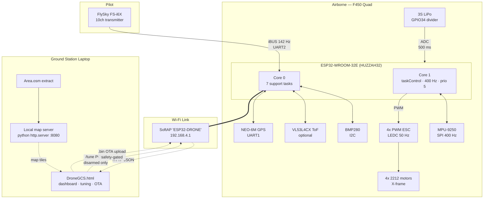
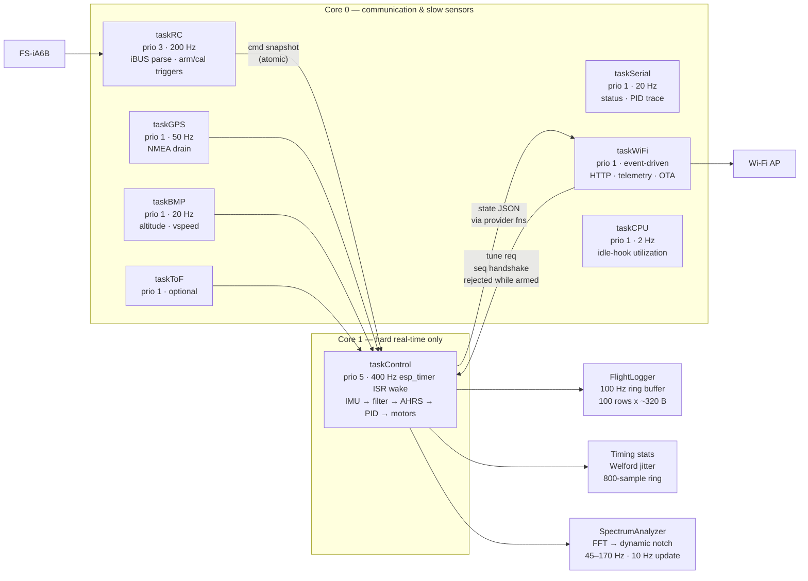
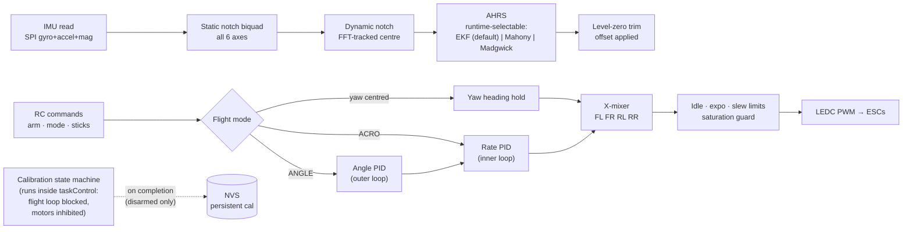
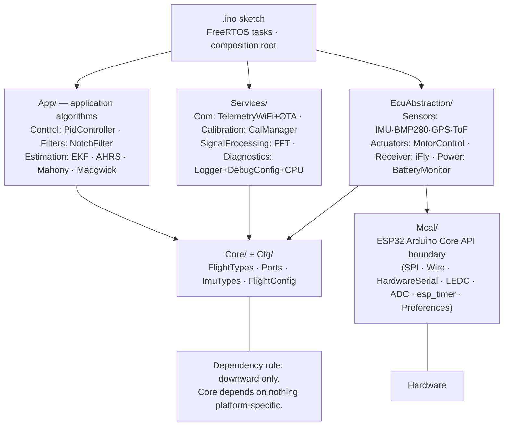
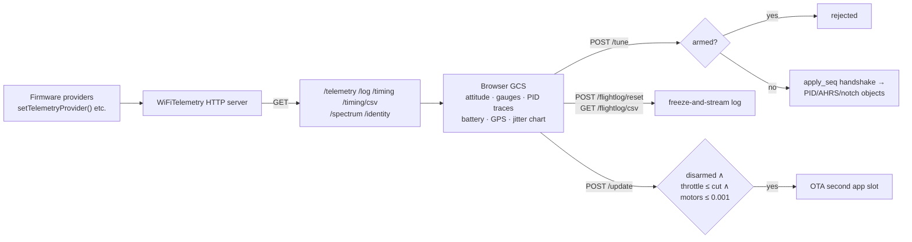

# ESP32-FlightStack — Architecture Diagrams

Code-verified against `RC_FlightController.ino` @ v6.1.0 (2893 lines, 8 FreeRTOS tasks).
Mermaid renders natively on GitHub.

## 1. System Overview

## 2. Firmware Task Architecture (dual-core FreeRTOS)

## 3. 400 Hz Control Pipeline (inside taskControl)

## 4. Software Layering (AUTOSAR-inspired, vendored)

Vendored note: all former `Submodules/*` git repositories are now plain
directories inside this repo, so layer boundaries are enforceable in one
tree. Original module repos remain on GitHub unchanged.
See `docs/LAYERS.md` for contracts and sanctioned exceptions.

## 5. Ground-Station Data Flow

