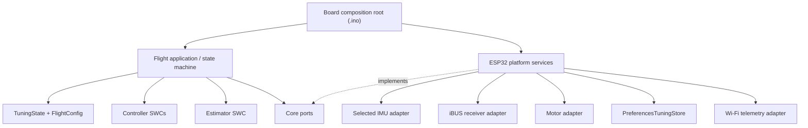
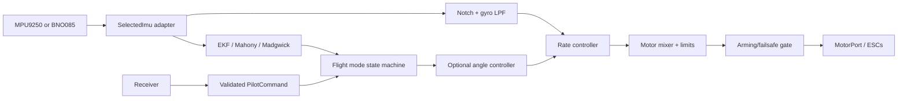
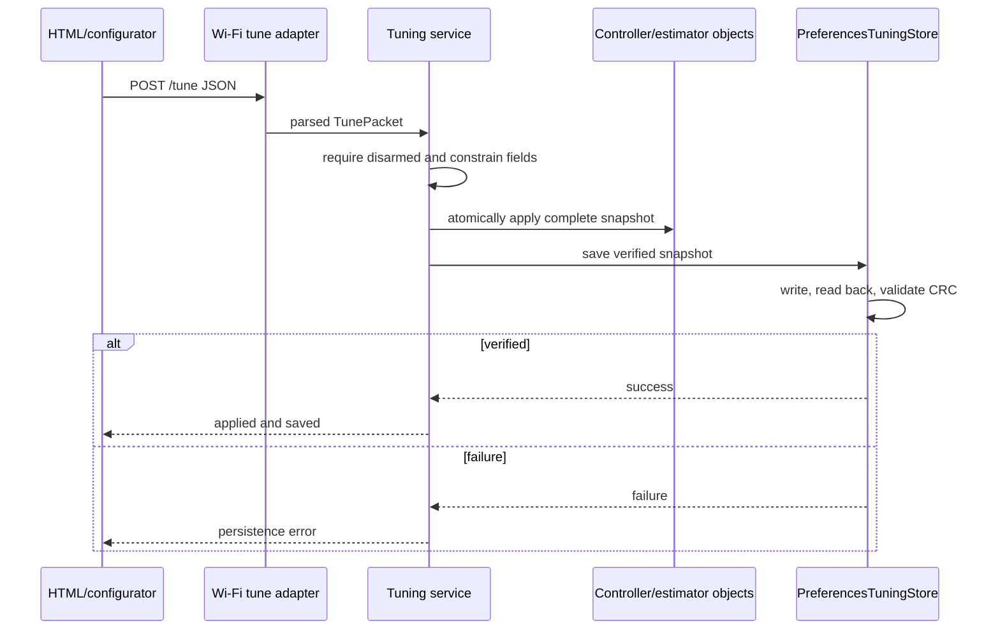

# Architecture V4 Composition and Runtime Flows

## Static composition



Solid arrows are allowed dependencies. Dashed arrows represent port implementation.
Core/Application must never point back to ESP32 or concrete drivers.

## Boot and configuration composition

```mermaid
sequenceDiagram
    participant Main as Composition root
    participant HW as ESP32 adapters
    participant Defaults as FlightConfig
    participant Store as PreferencesTuningStore
    participant App as Flight application
    participant Sched as FreeRTOS scheduler

    Main->>HW: construct and initialize safe hardware
    Main->>Defaults: initialize runtime tuning defaults
    Main->>Store: load(TuningState)
    alt record valid
        Store-->>Main: verified tuning snapshot
    else missing/corrupt/incompatible
        Store-->>Main: failure; retain defaults
    end
    Main->>App: apply configuration and connect ports
    Main->>Sched: create tasks and start 400 Hz timer
```

## IMU-to-motor control flow



At present these responsibilities are still partially co-located in the main control task;
the diagram is the required decomposition target and preserves the current signal path.

## Runtime tuning and permanent save flow



## Task composition

| Task/service | Core | Nominal rate | Inputs | Outputs |
| --- | ---: | ---: | --- | --- |
| Control | 1 | 400 Hz | IMU, command snapshot, tuning | estimator state, motor command, flight state |
| RC | 0 | receiver paced | iBUS bytes | validated command snapshot |
| ToF | 0 | 40 Hz | I2C range | timestamped range state |
| BMP280 | 0 | 20 Hz | I2C pressure | altitude/vertical-speed state |
| GPS | 0 | 50 Hz service | UART NMEA | GPS state |
| Wi-Fi | 0 | event driven | state snapshots, HTTP | telemetry and validated requests |
| Diagnostics/serial | 0 | low rate | state/log snapshots | noncritical output |

Shared snapshots must have one owner and bounded synchronization. No low-priority service may
hold a lock or perform an operation that blocks the 400 Hz control path.
