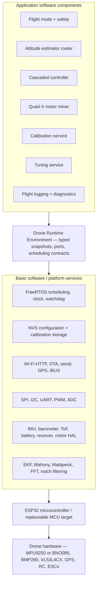
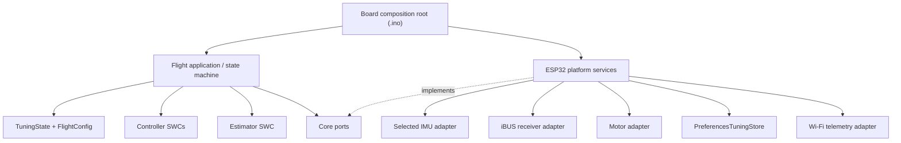
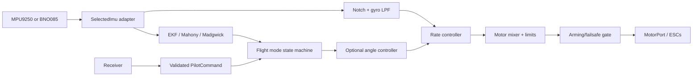
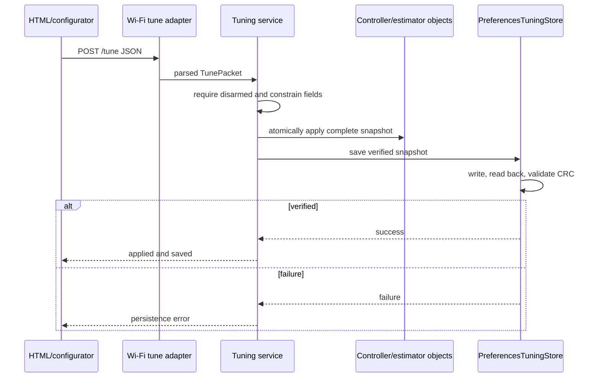

# Architecture V4 Composition and Runtime Flows

## AUTOSAR-inspired drone stack

This project uses AUTOSAR's separation principles without claiming AUTOSAR
Classic conformance. The RTE is a small typed runtime contract, and the ESP32/
Arduino/FreeRTOS implementation remains replaceable below that boundary.



Dependency direction is downward only. Application components cannot include
ESP32, Arduino, FreeRTOS, buses, or concrete board pins. Platform adapters
implement application-owned ports. The 108-line .ino file is the include-level
composition root. Concrete object wiring is grouped under src/Composition; SWC
behavior is under src/Application; ESP32 task and service adapters are under
src/Platforms/Esp32. The sketch contains no flight-control equations.

The normative runnable and port definitions—including datatype, direction, sender,
receiver, unit, range, validity, and communication type—are maintained in
[`SWC_PORT_MATRIX.md`](SWC_PORT_MATRIX.md).

## Static composition



Solid arrows are allowed dependencies. Dashed arrows represent port implementation.
Core/Application must never point back to ESP32 or concrete drivers.

## Boot and configuration composition

```mermaid
sequenceDiagram
    participant Main as Composition root
    participant HW as ESP32 adapters
    participant Defaults as FlightConfig
    participant Store as PreferencesTuningStore
    participant App as Flight application
    participant Sched as FreeRTOS scheduler

    Main->>HW: construct and initialize safe hardware
    Main->>Defaults: initialize runtime tuning defaults
    Main->>Store: load(TuningState)
    alt record valid
        Store-->>Main: verified tuning snapshot
    else missing/corrupt/incompatible
        Store-->>Main: failure; retain defaults
    end
    Main->>App: apply configuration and connect ports
    Main->>Sched: create tasks and start 400 Hz timer
```

## IMU-to-motor control flow



FlightControlSwc owns the deterministic 400 Hz orchestration. It exchanges
application data with the estimator, cascaded controller, mixer, level trim, receiver,
and state publishers through typed S/R ports. Hardware access is through IMU, battery,
motor, clock, and calibration C/S ports. The production control equations live in their
named controller/estimator/mixer modules rather than in the Arduino sketch.

## Runtime tuning and permanent save flow



## Task composition

| Task/service | Core | Nominal rate | Inputs | Outputs |
| --- | ---: | ---: | --- | --- |
| Control | 1 | 400 Hz | IMU, command snapshot, tuning | estimator state, motor command, flight state |
| RC | 0 | receiver paced | iBUS bytes | validated command snapshot |
| ToF | 0 | 40 Hz | I2C range | timestamped range state |
| BMP280 | 0 | 20 Hz | I2C pressure | altitude/vertical-speed state |
| GPS | 0 | 50 Hz service | UART NMEA | GPS state |
| Wi-Fi | 0 | event driven | state snapshots, HTTP | telemetry and validated requests |
| Diagnostics/serial | 0 | low rate | state/log snapshots | noncritical output |

Shared snapshots must have one owner and bounded synchronization. No low-priority service may
hold a lock or perform an operation that blocks the 400 Hz control path.

The concrete FreeRTOS task creation table and 400 Hz release timer are owned by
Esp32FlightScheduler. GPS, receiver, barometer, ToF, CPU, and Wi-Fi loops are implemented in
their named Platforms/Esp32/Tasks adapters. The task entry trampolines and board wiring are
isolated in src/Composition/Esp32TaskComposition.inc; each trampoline delegates immediately
to an SWC runnable or platform task adapter.

## Source ownership

| Location | Single responsibility |
| --- | --- |
| RC_FlightController.ino | declare build dependencies and assemble the four composition sections |
| src/Application/Runtime/FlightControlRuntime.inc | deterministic flight-control SWC runnables |
| src/Application/Diagnostics/SerialDiagnosticsRuntime.inc | noncritical serial diagnostics SWC runnables |
| src/Application/Control | controller and motor-mixing algorithms |
| src/Application/Estimation | estimator selection and attitude output |
| src/Composition/RuntimeObjects.inc | instantiate ports, SWCs, adapters, and shared runtime objects |
| src/Composition/ConfigurationTelemetryBindings.inc | translate HTTP/configurator requests and telemetry DTOs |
| src/Composition/Esp32TaskComposition.inc | bind SWC runnables to ESP32 task activations |
| src/Composition/FirmwareLifecycle.inc | boot order and scheduler start |
| src/Platforms/Esp32/Services | C/S adapters for ESP32 and concrete device services |
| src/Platforms/Esp32/Tasks | platform activation loops that call Init and Periodic |
